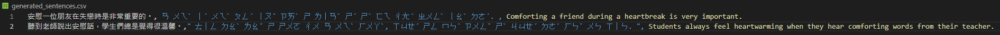

# Mandarin Anki Card Generator Python Scripts
## Two Python scripts to automate generating Anki cards for Mandarin Study.

1. First Script - Take input csv of words or sentences and generate Anki package, generating translations, synthesized speech, pinyin/zhuyin readings and related words.  
2. Second Script - Take input csv of words and generate example sentences.

I'm using Microsoft Azure cloud services for translation, transliteration and text-to-speech services, and ChatGPT to generate example sentences or related words.  

### Azure Cloud
You will need an Azure Cloud key with both Translation and Speech services deployed:  
Translation - https://learn.microsoft.com/en-us/azure/cognitive-services/translator/text-sdk-overview?tabs=python  
Speech - https://learn.microsoft.com/en-GB/azure/cognitive-services/speech-service/get-started-text-to-speech?tabs=windows%2Cterminal&pivots=programming-language-python  
Both of those offer a free tier which should be plenty for any individual language learner.

### ChatGPT
ChatGPT functionality is optional and disabled by default. If you want to use it you will need an OpenAI API Key. ChatGPT doesn't have a free tier, but unless you are generating millions of cards it shouldn't become too expensive.  
The second script for generating example sentences does work but it isn't much easier than just using the chat.openai.com portal to generate the sentences, and that online portal is free, so I would recommend doing that instead.  
ChatGPT API - https://platform.openai.com/docs/api-reference/authentication  

# Generate Cards Script - gencards.py
With this script you provide an input.csv file containing words, sentences or any combination of the two, and the script will then generate an anki .apkg file which can be imported into Anki.  
The Anki package bundles the model for both words and sentences along with the actual note data, meaning that the styling and different cards are all included. Running the script a second time should create a package which is compatiable with the first, so importing it will simply add the new cards to the preexisting deck rather than creating a new deck. I am currently not certain what will happen if you modify the models or card definitions in Anki and then import a new package.  

## Example Input file:  
  
Notice that translations are optional for both words and sentences. You don't need to indicate whether it is a word or sentence.  
Since it is a csv file, if the sentence contains a comma you need to surround the sentence with speech marks (") as in line five.  
Ensure the file is called **input.csv** and it is in the same folder as the python script.

## Words:  
You Provide - Mandarin Word, Definition (optional, will be generated if missing)  
Generated - Sound, Pinyin/Zhuyin, Related Words (optional, disabled by default)  

    <figure>
        
        <figcaption>Example word card with generated definition.</figcaption>
    </figure>
    <figure>
        
        <figcaption>Example word card with provided definition.</figcaption>
    </figure>

## Sentences:
You Provide - Mandarin Sentence, English Translation (optional, will be generated if missing)  
Generated - Sound, Pinyin/Zhuyin  
Any words in a sentence which are surrounded with stars (*) will be highlighted in the final cards, along with the associated reading.  

    <figure>
        
        <figcaption>Example sentence card with highlighted word/reading.</figcaption>
    </figure>
    <figure>
        
        <figcaption>Example word card with generated definition.</figcaption>
    </figure>
    <figure>
        
        <figcaption>Example word card with comma in definition.</figcaption>
    </figure>

## Output:
Anki apkg file. Import into Anki using File -> Import

## Options:
Options are found in the config.ini file.  
On first time running the program you will be prompted to input the necessary configuration data such as Azure API keys, but the optional configuration options will be set to their default values.  
- Azure speech voice(speech_api_voice_name) 
  - Default(zh-TW-YunJheNeural)
  - Can select whichever Microsoft Azure voice you like for text-to-speech synthesis.
  - Voice Gallery Here: https://speech.microsoft.com/portal/voicegallery
- Enable ChatGPT Functionality
  - Default(false)
  - If true, will use ChatGPT to generate related words when creating word cards.
- Use Traditional Mandarin
  - Default(false)
  - If false, assumes input is simplified, uses this assumption when translating, transliterating and analysing input hanzi.
  - If true, assumes input is traditional.
- Reading Format
  - Default(pinyin)
  - If pinyin, generates word and sentence readings as Pinyin
  - If zhuyin, generates word and sentence readings as Zhuyin

# Generate Sentences Script - gensents.py
With this script you provide an input.csv file containing words, and the script will then try to generate two example sentences for each word.  
Can use the same input.csv file as the main script. Any sentences will simply be ignored.  
I say *try to generate* because it uses ChatGPT, so there's no telling whether it will definitely create two sentences for each word, and whether the sentences it does generate will be in the correct format.  
Sometimes it generates more or fewer sentences. Sometimes it numbers those sentences. If it throws any errors or you aren't happy with the sentences try running it again.  
Alternatively, just use the same request in the online portal https://chat.openai.com.  
The generated sentences are written to the generated_sentences.csv file.

  
You can see here that ChatGPT decided to ignore the second word (中文) for whatever reason, but it did generate two sentences for 安慰.

This script uses the same config.ini file as the main script. It ignores all of the Anki or Azure related settings, it ignores the is_chatgpt_enabled setting (since there's no reason to use the script without ChatGPT), but it does adhere to the Mandarin related settings.